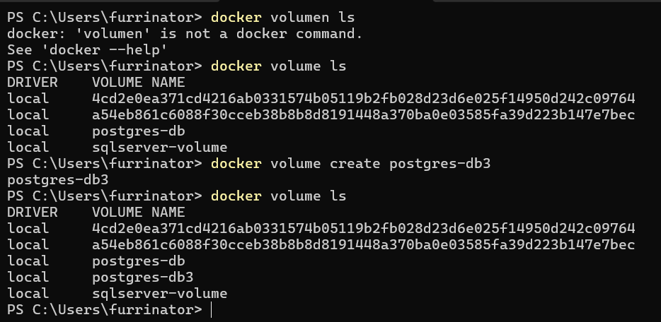

# PGadmin y POSTGRES

## DOCKER Hub Images

[posgres](https://hub.docker.com/_/postgres)

[pgadmin](https://hub.docker.com/r/dpage/pgadmin4)

1. crear un volumen para almacenar la infrmacion de la base de datos 

`docker volume create postgres-db3`

> ejemplo



2. crear el contenedor de postgres

```docker
docker container run -d --name postgres-dbbi -e POSTGRES_PASSWORD=NIKO -p 5434:5432 -v postgres-db3:/var/lib/postgresql/data postgres:15.1

```
 - b11aeae07228652e29648f9613c9066cf174fdfdd7f6e10dbcd3825a96f680c7

 -- 

### ver los volumenes

 docker volume ls
### borrar un container rm -f pgadmin
docker container  rm -f pgadmin2
- esto es para pgadmin no es nesesario colocar volumen el `-d` ya viene con el puerto hace las dos funciones al mismo tiempo 

 ```docker
docker container run --name pdadmin2 -e PGADMIN_DEFAULT_PASSWORD=NIKO -e PGADMIN_DEFAULT_EMAIL=NIKO@google.com -dp 8089:80 dpage/pgadmin4:6.17
```

- f8baab2fcba24c5fd5461e19aeba5b7e6396e6e36f5ae0e66ec5c7469f4327c1

4- crear red
`docker networkpostgres-net`

-eliminar 
`docker network rm 'name'`

5. conecctar ambos contenedores a la red 

`docker connet nombrecontenedor `